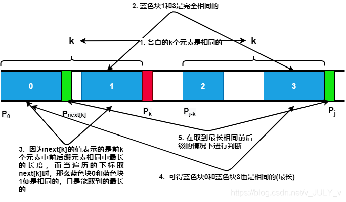

# Method 1: Brute Force
## procedure:
1. *i* is for haystack, *j* is for needle, and for every *j*, see if it equals to current
*i*, if so, *i* and *j* increase at the same time, otherwise *i* increases, *j* goes to
the start and keep trying.

# Method 2: KMP
## procedure:
1. Get `next` array.
2. Use the next array to find out subscripts(下标) needed.

## 1. Steps of getting `next` array(prefix table reduced by 1)(该next数组的值为最长前缀的下标）:
1. 如果当前i和j+1的字符匹配，则next\[i]=next\[i-1]+1得到。
2. 如果当前i和j+1的字符不匹配，就意味着当前的next\[i]的值不能直接由next\[i-1]+1得到。
3. 那应该如何得到当前的next\[i]呢？首先，如果当前i和j+1的字符不匹配,那么i 对应的最长相等前后缀的长度必定
短于i-1对应的。所以若是要从已有的next数组推next\[i]，则得从i-1开始，不停减小对应的前缀和后缀的长度直到满足要求
4. 由于后缀直接和当前的i连着，所以将后缀从前面砍掉一部分以保持和i连续.
5. 那么后缀要砍掉多少，也就是要保留多长的字符串呢？因为后缀得和前缀长度相等，所以后缀的长度可以由前缀的长度决定。
也就是说，前缀也得砍掉一部分，很显然是从后面砍。这里用下标替代长度（不用后缀下标是因为后缀下标不好表示长度），
6. 那么前缀要砍多少呢？很明显：① 前缀得和后缀相等；② 前缀得最大。即前缀得砍成最长的、和后缀相等的字符串。
用下标代替长度的话，就是说j+1（此时指向i-1的最长相等前后缀中的前缀后一位）得跳到哪个下标（这个下标前一位就是当前i对应
的最长相等前后缀的位置）。
7. 怎么跳呢？用next数组。因为next数组的值有两个含义：①当前下标对应的字符串其最长前缀的下标；②当前下标对应
的字符串其最长前缀的长度-1。
8. 也就是说，j跳到最长前缀的位置，观察此时j+1和i相不相等，若相等，那么这就是能找到的最长前缀了；若不相等，则继续往前找，
直到相等或者找到起点之后j=next\[0]=-1。

here is a picture to better understand:


code:
```java
//leetcode submit region begin(Prohibit modification and deletion)
class Solution {
    public int strStr(String haystack, String needle) {
        if(needle.length()==0)
            return 0;
        int j=-1;
        int[] next=new int[needle.length()];
        getNext(next,needle);
        //Where to jump depends on type of the next array
        for (int i = 0; i < haystack.length(); i++) {
            //Except when `j+1` =0
            while(j>=0&&haystack.charAt(i)!=needle.charAt(j+1))
                j=next[j];
            if(haystack.charAt(i)==needle.charAt(j+1))
                j++;
            if(j==needle.length()-1)
                return (i-needle.length()+1);
        }
        return -1;
    }
    //next数组的值为最大前缀的小标，而非其后一位
    public void getNext(int[] next,String s){
        int j=-1;
        next[0]=j;
        for (int i = 1; i < s.length(); i++) {
            while(j>=0&&s.charAt(i)!=s.charAt(j+1))
                j=next[j];
            if(s.charAt(i)==s.charAt(j+1))
                j++;
            next[i]=j;
        }
    }
}
//leetcode submit region end(Prohibit modification and deletion)
```
## 2. prefix table didn't reduce by 1 (idea is the same as 1.)(该next数组的值为最长前缀的后一位的下标)