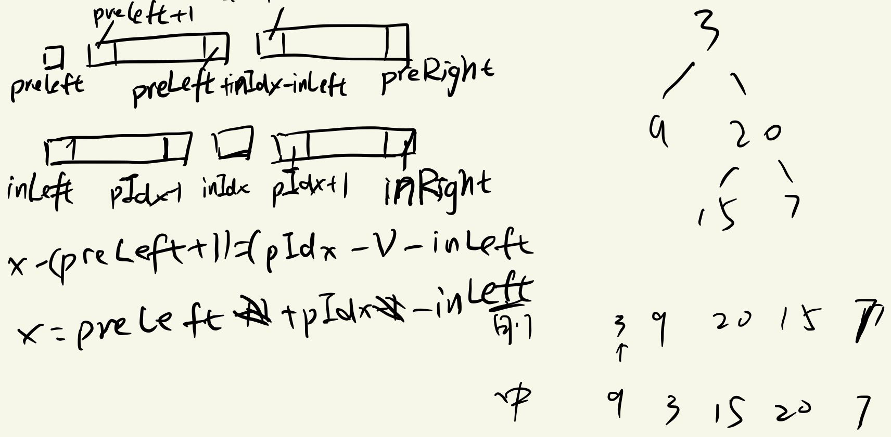

# 方法一：递归
1. 根据前序遍历找根结点，根据根结点的值找在中序遍历中的位置（用HashMap快一点），根据其位置判断左右子树，然后递归
该操作即可
2. 同时利用到preorder和inorder的上下界下标比只用其中之一的逻辑更加清晰
3. 

代码：
```java
class Solution {
    public TreeNode buildTree(int[] preorder, int[] inorder) {
        int preLen=preorder.length;
        int inLen=inorder.length;
        int i=0;
        Map<Integer,Integer> inMap= new HashMap<>();
        //需要根据值来找中序遍历中的下标，所以value为下标
        for (int val : inorder) {
            inMap.put(val,i++);
        }
        return buildTree(0,preLen-1,0,inLen-1,inMap,preorder);
    }

    /*
        递归构建子树的过程中，并不需要用到inorder数组，因为只需要找到根结点在inorder数组中的下标，其左边为
        左子树，右边为右子树，就可以进行下一次递归，而不需要具体的值。这点inMap就可以做到
     */
    private TreeNode buildTree(int preLeft, int preRight, int inLeft, int inRight,
                               Map<Integer, Integer> inMap,int[] preorder) {
        if(preLeft>preRight||inLeft>inRight) return null;
        int rootVal=preorder[preLeft];
        TreeNode root=new TreeNode(rootVal);
        int inIdx=inMap.get(rootVal);
        root.left=buildTree(preLeft+1,preLeft+inIdx-inLeft,inLeft, inIdx-1,
                inMap,preorder);
        root.right=buildTree(preLeft+inIdx-inLeft+1,preRight,inIdx+1,inRight,
                inMap,preorder);
        return root;
    }
}

```