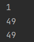

# Methode 1: Use Deque as Stack
ideas:
1. Notice! There are differences between transforming *String* to *Integer* and
*char* to *Integer*. Here is an instance.
>
        String s="1";
        char c='1';
        System.out.println(Integer.valueOf(s));
        System.out.println(Integer.valueOf(c));
        System.out.println((int) c);
> Output:
         
2. If Deque is used as stack, the order of entry and exit should be fixed, such as 
`stack.addFirst` and `stack.pollFirst` or `stack.addLast` and `stack.pollLast`
3. The first popped is divisor(除数), the second popped is the dividend(被除数).

code:
```java
import java.util.Deque;
import java.util.LinkedList;

//leetcode submit region begin(Prohibit modification and deletion)
class Solution {
        public int evalRPN(String[] tokens) {
                int len=tokens.length;
                Deque<Integer> stack=new LinkedList<>();
                for(String token : tokens) {
                        if (isOpe(token)) {
                                char c = token.charAt(0);
                                int num1 = stack.pollLast();
                                int num2 = stack.pollLast();
                                if (c == '+') stack.addLast(num2 + num1);
                                else if (c == '-') stack.addLast(num2 - num1);
                                else if (c == '*') stack.addLast(num2 * num1);
                                else stack.addLast(num2 / num1);
                        }else stack.addLast(Integer.valueOf(token));
                }
                return stack.peek();
        }
        private boolean isOpe(String s){
                return s.length()==1&&(s.charAt(0)<'0'||s.charAt(0)>'9');
        }
}
//leetcode submit region end(Prohibit modification and deletion)
```